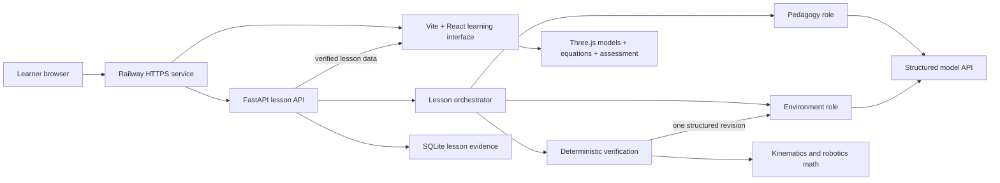

# AxisLab

**A verified, interactive robotics tutor for the OpenAI Build Week Education track.**

[Live demo](https://axislab-openai-production.up.railway.app) ·
[Submission draft](SUBMISSION.md) ·
[Architecture](docs/ARCHITECTURE.md) ·
[Demo script](docs/DEMO_SCRIPT.md) ·
[MIT License](LICENSE)

AxisLab helps university robotics learners connect equations to physical motion.
Instead of reading a static derivation, a learner predicts an outcome, manipulates a
3D model, observes synchronized mathematics, answers a knowledge check, and receives
evidence-based feedback.

The public demo is free, requires no account, and runs as one Vite + FastAPI service:

- **Application:** <https://axislab-openai-production.up.railway.app>
- **Health check:** <https://axislab-openai-production.up.railway.app/health>
- **API documentation:** <https://axislab-openai-production.up.railway.app/docs>

## The education problem

Robotics courses introduce compact notation for coordinate systems, orientation,
kinematics, trajectories, and forces. Students can often reproduce a formula without
being able to predict what it will do to a robot. AxisLab closes that gap by keeping
the geometry, equations, controls, and assessment in one learning surface.

Every lesson follows the same active-learning loop:

1. **Predict** what a parameter will change.
2. **Manipulate** a verified model with sliders or direct 3D interaction.
3. **Observe** the corresponding frames, matrices, vectors, and numerical state.
4. **Explain and check** understanding with scored questions.
5. **Reflect** using feedback grounded in the learner's recorded actions.

## Learning modules

- **Canadarm teaching model:** standard-DH parameters, mixed revolute/prismatic
  joints, synchronized matrices, and direct no-AI sliders.
- **Coordinate systems:** Cartesian, cylindrical, and spherical coordinates with
  decomposition paths, conversions, singularities, and knowledge checks.
- **RPY / Euler wrist:** interactive ZYX roll-pitch-yaw and ZYZ Euler orientation,
  inverse angle recovery, equivalent solutions, and singularity detection.
- **Jacobian / differential motion:** a planar 2R model mapping joint rates to tool
  velocity while exposing determinant and rank loss.
- **Trajectory planning:** cubic and quintic joint-space profiles with position,
  velocity, acceleration, duration, and endpoint constraints.
- **Forces and dynamics:** live `tau = J^T F`, gravity compensation, and
  configuration-dependent holding torque.

Natural-language questions can also request a customized advanced lesson. The model
selects bounded initial conditions, difficulty, misconceptions, and investigation
prompts. Trusted code validates every parameter and remains responsible for numerical
answers and scoring.

## Verification-first AI design

AxisLab separates generative work from mathematical authority:

1. A **Pedagogy role** identifies the learning goal and likely misconception.
2. An **Environment role** proposes a constrained lesson or robot topology.
3. A deterministic **Verification layer** checks schemas, limits, renderability,
   activity wiring, and forward kinematics.
4. Rejected output receives one structured revision attempt; repeated failure activates
   a reviewed local fallback.

Model output is never executed as Python, JavaScript, shell, or rendering code. The
browser receives only allow-listed, schema-validated lesson data. The current live
adapter uses Qwen through an OpenAI-compatible structured-completion client; template
mode runs entirely without an external model.

## Architecture



See [docs/ARCHITECTURE.md](docs/ARCHITECTURE.md) for trust boundaries and
[RENDERER_ARCHITECTURE.md](RENDERER_ARCHITECTURE.md) for the verified scene contract.

## What was built during OpenAI Build Week

The project was meaningfully extended during the submission period with:

- real answer evaluation and evidence-based scoring;
- direct, model-free controls for the robot demonstration;
- global navigation across six robotics learning modules;
- interactive coordinate, wrist, Jacobian, trajectory, and dynamics laboratories;
- AI-customized advanced lesson generation with deterministic parameter verification;
- a responsive full-window interface for desktop and smaller screens;
- a single-container Railway deployment and automated health check; and
- expanded backend and frontend test coverage.

Codex was used as the implementation partner for repository analysis, architecture
decisions, mathematical review, React/Three.js development, FastAPI contracts, tests,
responsive design, deployment migration, and submission preparation. The Devpost entry
must include the `/feedback` Session ID for the primary Codex task and accurately state
where GPT-5.6 was used; this repository does not invent model-use evidence that has not
been independently verified.

## Repository layout

```text
axislab-openai-build-week/
├── backend/
│   ├── app/
│   │   ├── agents.py           # structured teaching/environment contracts
│   │   ├── orchestrator.py     # revision and fallback workflow
│   │   ├── module_lessons.py   # customized advanced lessons
│   │   ├── validation.py       # deterministic lesson verification
│   │   ├── kinematics.py       # standard-DH forward kinematics
│   │   ├── storage.py          # SQLite evidence storage
│   │   └── main.py             # FastAPI routes and static frontend
│   └── tests/
├── frontend/src/
│   ├── App.tsx
│   ├── components/
│   ├── renderer/
│   ├── advancedRobotics.ts
│   └── kinematics.ts
├── docs/
├── Dockerfile
├── railway.json
└── SUBMISSION.md
```

## Run locally

Requirements: Python 3.12+, [uv](https://docs.astral.sh/uv/), Node.js 20+, and
npm 10+.

### Backend

```bash
cd backend
uv sync --extra dev
cp .env.example .env
# Optional: add an authorized QWEN_API_KEY for live customized lessons.
uv run uvicorn app.main:app --reload --host 127.0.0.1 --port 8000
```

Without a model key, use template mode for deterministic local demonstrations.

### Frontend

```bash
cd frontend
npm ci
npm run dev -- --host=127.0.0.1
```

Open <http://127.0.0.1:5173>. Vite proxies relative `/api` requests to FastAPI.
Set `VITE_AGENT_PROVIDER=template` in `frontend/.env` to force local template mode.

## Test

```bash
cd backend
uv run pytest

cd ../frontend
npm test
npm run lint
npm run build
```

Current verified test count: **21 backend tests and 20 frontend tests**.

## API

| Method | Path | Purpose |
|---|---|---|
| `GET` | `/health` | Service health |
| `POST` | `/api/lessons` | Create a verified standard-DH lesson |
| `POST` | `/api/module-lessons` | Create a verified customized advanced lesson |
| `POST` | `/api/scenes` | Validate a custom standard-DH scene |
| `GET` | `/api/lessons/{id}/trace` | Retrieve a secret-free generation trace |
| `POST` | `/api/lessons/{id}/validate-state` | Compare client and server kinematics |
| `POST` | `/api/lessons/{id}/events` | Submit learner evidence idempotently |
| `POST` | `/api/lessons/{id}/feedback` | Generate evidence-grounded feedback |

## Mathematical convention

The serial-arm renderer uses standard DH:

\[
{}^{i-1}T_i = R_z(\theta_i)T_z(d_i)T_x(a_i)R_x(\alpha_i)
\]

- `theta_i` rotates about `z_(i-1)`.
- `d_i` translates along `z_(i-1)`.
- The generic renderer supports validated mixed serial R/P chains.

## Safety and scope

- Trusted code owns geometry, units, identifiers, numerical answers, and scoring.
- Custom DH scenes pass through a separate validated API contract.
- AxisLab does not execute generated code or load arbitrary 3D assets.
- The project is an educational visualization tool, not a safety-certified robot
  controller or dynamics simulator.

## License

AxisLab is released under the [MIT License](LICENSE).
