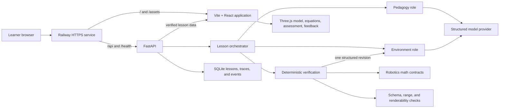

# AxisLab Architecture

## System view



The production Docker image builds the Vite application and copies it into the FastAPI
runtime. FastAPI serves both the static application and same-origin API routes. Railway
provides HTTPS routing and checks `/health` during deployment.

## Educational flow

```text
question or module selection
  -> constrained lesson proposal
  -> deterministic verification
  -> interactive prediction
  -> parameter manipulation
  -> synchronized visualization and mathematics
  -> scored knowledge check
  -> evidence-grounded feedback
```

Direct demonstration mode skips model generation and loads reviewed local lesson data.
This keeps the core educational experience available during provider outages and gives
judges a reproducible testing path.

## Trust boundary

The model may propose teaching language, topic selection, difficulty, bounded initial
conditions, and investigation prompts. Trusted Python and TypeScript code owns:

- schemas and allowed topic identifiers;
- parameter ranges and finite-number checks;
- robot geometry and renderer modules;
- forward kinematics and advanced robotics equations;
- expected answers and scoring; and
- persistence and idempotent learner events.

Model output is never evaluated as Python, JavaScript, shell, or generated rendering
code. The browser receives only validated lesson data.

## Failure handling

1. Validate every generated proposal deterministically.
2. Return structured issue codes to the environment role for one revision.
3. Use a reviewed server fallback after a second rejection or provider failure.
4. Use a browser-local verified lesson when the API is unavailable.

## Persistence boundary

The default container uses in-memory SQLite because the public demonstration does not
require long-term learner accounts. `AXISLAB_DB_PATH` can point to a persistent volume
for deployments that need durable lessons, traces, and interaction evidence.

## Deployment files

- `Dockerfile` builds the frontend and backend into one image.
- `railway.json` configures the Docker build and `/health` check.
- Secrets stay in deployment environment variables and are never bundled into Vite.
